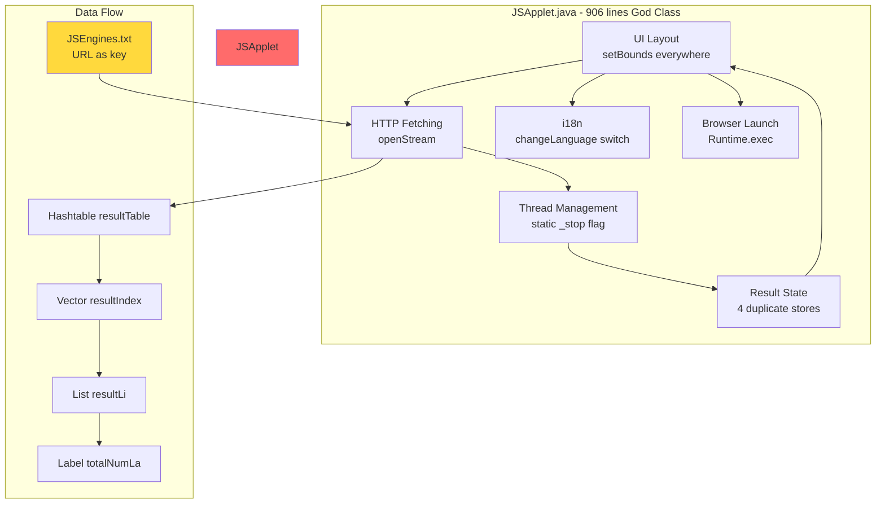
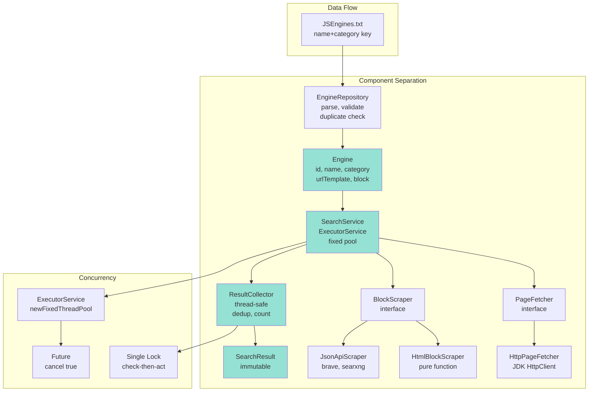

# JSearch Architecture Comparison

## Original Design (2002)

## Modern Reference Design

## Key Improvements

| Aspect | Original | Modern |
|--------|----------|--------|
| **Identity** | URL as key (collides) | (name, category) tuple |
| **Threading** | 1 Thread per engine, manual counter | ExecutorService fixed pool |
| **Cancellation** | Polled boolean flag | Future.cancel(true) interrupts |
| **Result State** | 4 duplicate stores | Single ResultCollector |
| **Dedup** | TOCTOU race | Atomic check-then-act under lock |
| **Scraper** | Inline, mutates statics | Pure function, testable |
| **Testing** | None | 35 tests, archive fixtures |
| **Encoding** | GBK implicit | UTF-8 explicit |
| **Build** | Visual J++ only | JDK 11+, platform-agnostic |
